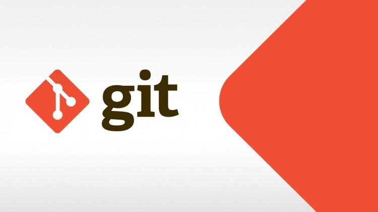

# web-sitem
<!DOCTYPE html>
<html lang="tr">

<head>
    <title>Görkem karaca- Kişisel Web Sitesi</title>
    <meta charset="UTF-8">
    <meta name="description" content="Görkem karaca - Kişisel Web Sitesi">
    <meta name="keywords" content="grkem karaca">
    <meta name="author" content="Görkem karaca">
    <meta name="viewport" content="width=device-width, initial-scale=1">
    <link rel="stylesheet" href="css/bootstrap.min.css">
    <link href="https://fonts.googleapis.com/css?family=Montserrat" rel="stylesheet">
    
    
    <link rel="stylesheet" href="https://cdnjs.cloudflare.com/ajax/libs/font-awesome/4.7.0/css/font-awesome.min.css">

    
</head>

<body>

    <!-- Navbar -->
    <nav class="navbar navbar-default">
        

            

                
                    
                    
                    
                </button>
                >
                <a class="navbar-brand" href="#">Görkem karaca</a>
               
            
,<nav class="navbar bg-white border-bottom border-body" data-bs-theme="White">
                
                  
                        <li><a href="#kimdir">Kimdir?</a></li>
                        <li><a href="#neyapar">Ne yapar?</a></li>
                        <li><a href="#blog">Blog</a></li>
                        <li><a href="#iletisim">İletişim</a></li>
                  
                

            

              </nav>
            
    </nav>

    <!-- First Container -->
    

        <h3 class="margin">Merhaba, Ben Görkem!</h3>
        
        <h3>Yazılım Geliştiririm</h3>
    

    <!-- Second Container -->
    

        <h3 class="margin">Neler Yaparım?</h3>
        
        
yazılım geliştirme bölümünde okuyorum genellikle kod yazarım.
            Yeni bişeyler keşfetmeyi severim.
            Spor yapmayı severim.. 
        

    

        

    <!-- Third Container (Grid) -->
    

        <h3 class="margin">Blog</h3>
         
        

            

                
Git, yazılım geliştirme süreçlerinde kullanılan, hız odaklı, dağıtık çalışan bir sürüm kontrol ve kaynak kod yönetim sistemidir.

                
            

            

                
HTML, Hiper Metin İşaretleme Dili (Hypertext Markup Language) web sayfalarını oluşturmak için kullanılan metin işleme dilidir.

                
            

            

                
Python bir programlama dilidir. Diğer programlama dillerinde olduğu gibi bilgisayarlara hükmetmeyi sağlar. 

                
            

            

                
 geliştirme döngüsünün tamamını tek bir yerde tamamlamak için kullanabileceğiniz güçlü bir geliştirici aracıdır. 

                
            

            

                
web tabanlı bir sürüm kontrol sistemi ve kod deposu platformudur. 

                
            

            

                
Android sistemi üzerinden uygulama geliştirmeye yarayan platforma denir. 

                
            

        

    

    <!-- Contact -->
    

        <h3 class="margin">İletişim sayfasına hoşgeldiniz</h3>
         
        

            

                
Merhaba demek ister misin?

                
 balıkesir, TR

                
 05370259985

                
 gorkemkaraca@gmail.com

            

            <form>
                

                  <label for="exampleInputEmail1" class="form-label">Eposta adresi</label>
                  <input type="email" class="form-control" id="exampleInputEmail1" aria-describedby="emailHelp">
                  
Eposta'nızı asla başkasıyla paylaşmayacağız.

                

                

                  <label for="exampleInputPassword1" class="form-label">Şifre</label>
                  <input type="password" class="form-control" id="exampleInputPassword1">
                

                

                  <input type="checkbox" class="form-check-input" id="exampleCheck1">
                  <label class="form-check-label" for="exampleCheck1">Beni kontrol et</label>
                

                <button type="submit" class="btn btn-primary">Gönder</button>
              </form>
    
    

</body>

</html>
